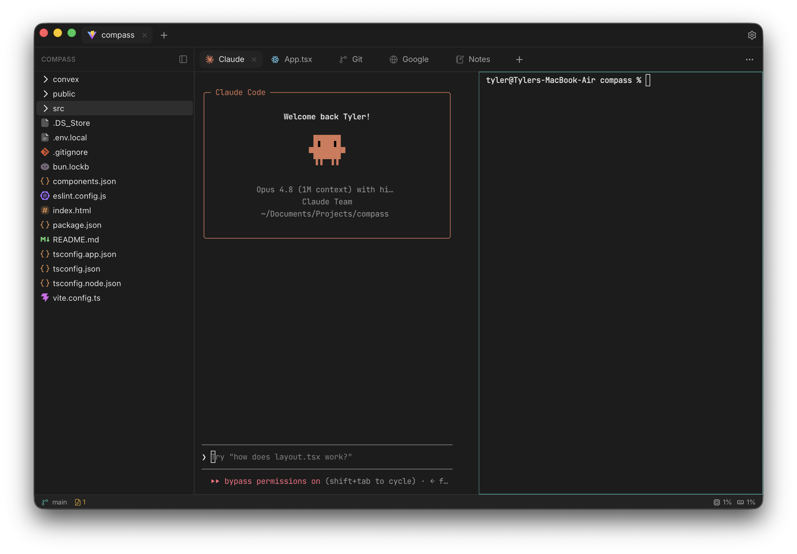

<div align="center">


# Meridian

**A terminal-forward, agentic development environment.**

Native shell, embedded browser, Git, and a Monaco editor in one window —
with first-class support for running Claude in-app.

[Features](#features) · [Quick start](#quick-start) · [Keyboard shortcuts](#keyboard-shortcuts) · [Building](#building-from-source) · [Releases](#installing-a-release)

</div>

---

> [!NOTE]
> Meridian is in active development (pre-1.0). It is Windows- and macOS-primary;
> Linux is supported on a best-effort basis.

## Overview

Meridian pulls the tools you reach for during a coding session into a single
native window. Open a folder and you get real PTY terminals, a Monaco editor
with language intelligence, an embedded browser, full Git tooling, and a
dedicated Claude tab — all in keep-alive tabs whose state survives tab switches
and app restarts.

It is built on [Tauri v2](https://v2.tauri.app/): a Rust core for the heavy
lifting (terminals, process monitoring, Git, the language server) and a React
frontend for the UI.

<div align="center">
  
</div>

## Features

### Workspace

- **Projects and tabs** — open a folder and work across keep-alive tabs
  (terminal, editor, browser, Git, Claude, notes). Layout, open tabs, and pane
  splits are restored on restart.
- **File tree** — a virtualized project tree that skips noise directories
  (`node_modules`, `.git`, `target`, `dist`, …).
- **Go to File** — VS Code-style fuzzy file finder (`Ctrl`/`Cmd`+`P`).
- **Settings** — shell selection, editor preferences, diff style, theme, and
  integrations, all in one dialog.

### Terminals

- **Real PTYs** — backed by `portable-pty` (ConPTY on Windows), not a faked
  shell. Output is coalesced and frame-limited so heavy logs never freeze the UI.
- **Splits** — recursively split any terminal tab into resizable row/column
  panes.

### Editor

- **Monaco** — one editor instance with per-file models, dirty tracking, save,
  and an optional minimap.
- **Language intelligence (TypeScript/JavaScript)** — diagnostics, completions,
  hover, go-to-definition, and rename via a bundled TypeScript language server
  (project-local install preferred when present).
- **Prettier formatting** — formats with your project-local Prettier and config
  when available, falling back to a bundled copy. Optional format-on-save.

### Git

- **Source control panel** — staged/unstaged/untracked file lists, stage,
  unstage, discard, commit, push, pull, and fetch.
- **Diff viewer** — working-tree diffs in unified or split layout, with a
  whitespace-ignore toggle.
- **Branches** — switch branches (ordered by most recent commit) or create a new
  one on checkout, with ahead/behind and unpushed-commit status.

### Embedded browser

- Native webview browser tabs with back/forward/reload, a URL bar, and history.
- New-tab and `target="_blank"` navigations are intercepted; pages have **no IPC
  access** to the app.

### Claude integration

- A **Claude** tab launches the `claude` CLI in a terminal.
- The status bar shows live **5-hour and weekly usage**, read from the same
  source as the `/usage` command (hidden when no credentials are present).

### Built-in monitoring

- **Resource Manager** — per-project CPU and RAM in the status bar, broken down
  by terminals (Claude vs. plain shell), language server, and browser tabs. On
  Windows, browser memory is attributed per WebView2 renderer.
- **Freeze watchdog** — UI-thread stalls and long tasks are logged to a durable
  file with surrounding context, for diagnosing rare hangs.

### Notes & integrations

- **Notes** — a per-project Markdown scratchpad with live GitHub-Flavored
  Markdown preview.
- **Jira (optional)** — connect via OAuth to turn an issue key (e.g.
  `OWS-12345`) into a ready-to-use branch name.

### Distribution

- **Auto-update** — signed updates are checked, downloaded, and installed from
  the GitHub Releases feed, with verification before applying.

## Tech stack

| Layer             | Technology                                             |
| ----------------- | ------------------------------------------------------ |
| Shell             | Tauri v2 (Rust)                                        |
| Frontend          | React 19, TypeScript, Vite, Tailwind CSS v4, shadcn/ui |
| Terminal          | `portable-pty` (Rust) streamed to `@xterm/xterm`       |
| Editor            | Monaco + `typescript-language-server`                  |
| File tree / diffs | `@pierre/trees`, `@pierre/diffs`                       |
| Monitoring        | `sysinfo`, WebView2 COM (Windows)                      |

## Quick start

### Prerequisites

- [Node.js](https://nodejs.org/) 18+
- [Rust](https://www.rust-lang.org/tools/install) (stable, 1.77.2+)
- Platform Tauri prerequisites — see the
  [Tauri v2 setup guide](https://v2.tauri.app/start/prerequisites/). On Windows
  this is the WebView2 runtime and the MSVC C++ build tools.

### Run in development

```bash
npm install
npm run tauri dev
```

## Keyboard shortcuts

| Action                      | Windows / Linux    | macOS             |
| --------------------------- | ------------------ | ----------------- |
| Open project                | `Ctrl`+`O`         | `Cmd`+`O`         |
| Go to File                  | `Ctrl`+`P`         | `Cmd`+`P`         |
| Open settings               | `Ctrl`+`,`         | `Cmd`+`,`         |
| Toggle sidebar              | `Ctrl`+`B`         | `Cmd`+`B`         |
| Split terminal (vertical)   | `Ctrl`+`D`         | `Cmd`+`D`         |
| Split terminal (horizontal) | `Ctrl`+`Shift`+`D` | `Cmd`+`Shift`+`D` |
| Close pane / tab            | `Ctrl`+`W`         | `Cmd`+`W`         |

## Building from source

```bash
npm run tauri build
```

Artifacts are written to `src-tauri/target/release/` (the standalone
`meridian` executable) and `src-tauri/target/release/bundle/` (platform
installers).

> [!WARNING]
> Local builds are unsigned, so Windows SmartScreen and macOS Gatekeeper will
> warn on first launch. Configure code signing in `src-tauri/tauri.conf.json`
> for distribution.

## Installing a release

Pushing a `vX.Y.Z` tag triggers CI to build and publish installers to a GitHub
Release. Pick the artifact for your platform:

| Platform              | Artifact                            | Notes           |
| --------------------- | ----------------------------------- | --------------- |
| Windows (64-bit)      | `Meridian_<version>_x64-setup.exe`  | NSIS installer  |
| macOS (Apple Silicon) | `Meridian_<version>_aarch64.dmg`    | M1/M2/M3/M4     |
| macOS (Intel)         | `Meridian_<version>_x64.dmg`        |                 |
| Linux (64-bit)        | `Meridian_<version>_amd64.AppImage` | distro-agnostic |

Released builds are unsigned. On first launch:

- **macOS** — right-click the app and choose **Open**, then confirm (Gatekeeper).
- **Windows** — choose **More info → Run anyway** (SmartScreen).

Once installed, Meridian updates itself from subsequent releases.

## Project structure

```
src/              React + TypeScript frontend
  components/     UI (tabs, editor, terminal, browser, Git, status bar, …)
  lib/            Tauri command wrappers, LSP client, persistence, helpers
src-tauri/        Rust backend (PTY, browser, Git, LSP, monitoring, updater)
scripts/          Build/release helper scripts
```

## Platform support

Windows- and macOS-primary. Linux is best-effort: the AppImage is built and
runs, but receives less testing, and some Windows-specific monitoring (per-tab
browser memory attribution) is unavailable.
